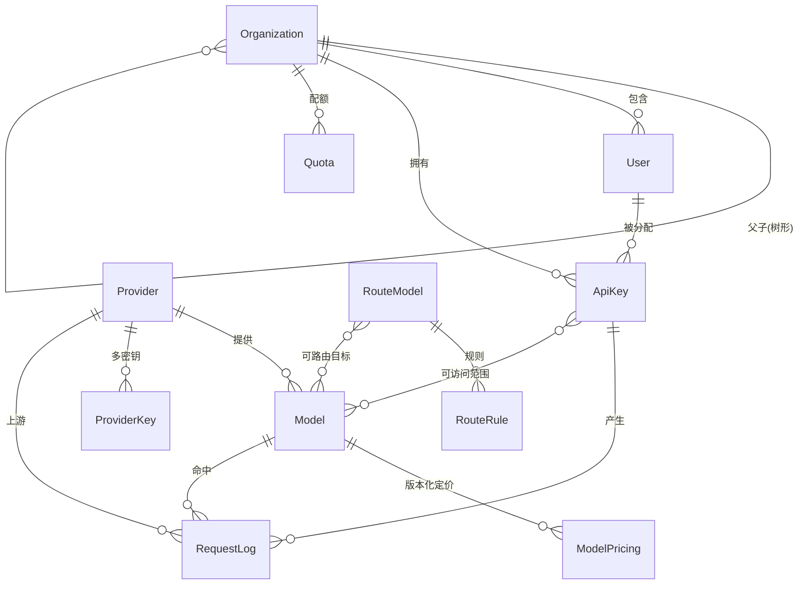

# Tensu — 大模型网关平台 PRD

## 1 项目概述

Tensu 是一个企业级大模型网关平台，提供统一的 LLM API 接入、供应商管理、智能路由、上下文压缩、用量审计等能力。目标是让业务方通过单一端点即可访问所有供应商的模型，同时获得成本可控、可观测、安全合规的使用体验。

## 2 术语表

| 术语     | 说明                                                                     |
| -------- | ------------------------------------------------------------------------ |
| 供应商   | 提供 OpenAI 兼容或 Anthropic 兼容 API 的大模型服务商                     |
| 影子模式 | 路由模型的一种模式，应用侧选择路由模型，平台侧可实时切换到任意实际模型   |
| 路由模式 | 路由模型的另一种模式，由路由引擎根据意图识别和规则自动分发到实际模型     |
| CCR      | 可逆压缩（Convertible/Reversible Compression），压缩后可完整还原原始内容 |
| 路由引擎 | 由路由模型 + 规则引擎组成，负责将请求智能分发到合适的后端模型            |

## 3 功能需求

### 3.1 大模型供应商管理

* 支持配置适配 OpenAI 接口或 Anthropic 接口的供应商；
* 供应商模型列表支持自动拉取或手动添加；
* 模型能力标记：
  * 是否支持视觉（Vision）
  * 是否支持推理（Reasoning）
  * 是否支持工具调用（Tool Use）
* 模型推理选项：
  * 二值模式：thinking / non-thinking
  * 强度模式：none / low / medium / high / max / xhigh 中的若干组合
* 模型需标注输入和输出的上下文窗口大小；
* **模型定价配置**：
  * 每个模型可配置输入单价、输出单价（如按每百万 token 计）；
  * 支持缓存命中输入单价、推理（thinking）token 单价等差异化定价；
  * 支持币种设置与统一折算汇率；
  * 定价支持版本化（记录生效时间），历史用量按当时单价计算成本；
* 允许同一供应商添加多个 API Key；
* 供应商健康检查（定时心跳探测，故障自动标记）；
* 密钥轮换策略（轮询、权重分配、故障自动跳过）；
* 模型能力评估矩阵（按能力维度可视化对比各模型）。

### 3.2 大模型网关

* 代理 OpenAI 和 Anthropic 协议，**透传不转换**；
* 所有模型统一代理到同一端点，以 `供应商-模型` 形式展示；
* 支持非流式和流式（SSE/Streaming）响应透传。

#### 3.2.1 负载均衡

* **同名模型负载均衡**：同一模型名跨多个供应商时，按策略（轮询/权重/最低延迟）分发；
* **同供应商 Key 负载均衡**：同一供应商多 Key 间按策略分发；
* 故障转移：某 Key/供应商不可用时自动切换到可用实例。

#### 3.2.2 限流与配额

* 支持按 API Key 维度设置 Rate Limit（RPM / TPM）；
* 支持按组织架构维度设置 Token 配额（日/月）；
* 限流触发时返回标准 429 响应及 Retry-After 头；
* 支持按模型维度设置并发上限。

#### 3.2.3 重试策略

* 可配置重试次数、退避算法（指数退避 + 抖动）；
* 仅对幂等请求（非流式、无副作用）执行重试；
* 重试时自动切换到其他可用 Key/供应商。

#### 3.2.4 缓存

* 支持语义缓存和精确缓存；
* 缓存 Key 设计：model + messages hash + parameters hash；
* 可配置 TTL、缓存开关（按模型/按组织）；
* 缓存命中时返回原始响应，标记 `X-Cache: HIT`；
* **流式响应缓存**：缓存完整聚合后的响应体；命中时可按客户端请求以流式（分块回放）或非流式形式返回，回放时 TTFT 按缓存路径统计。

#### 3.2.5 错误处理

* 统一错误响应格式（标准 HTTP 状态码 + 业务错误码）；
* 上游错误映射表（将各供应商错误码统一转换为平台错误码）；
* 错误响应中携带 request_id 用于追踪。

### 3.3 路由模型

路由模型名称可自定义，对外表现为一个虚拟模型。分为两种模式：

#### 3.3.1 影子模式

* 应用侧选择该路由模型发起请求；
* 管理员可在平台上**实时切换**实际路由到的目标模型，切换立即生效；
* 适用于 A/B 测试、模型灰度、生产热切换等场景。

#### 3.3.2 路由模式

* 由路由引擎自动将请求分发到最合适的后端模型。
* **路由引擎**由两部分组成：
  * **路由模型**：通过 API 接入（配置方式同供应商），对用户输入做意图识别和复杂度评估，输出推荐的目标模型；
  * **规则引擎**：当路由模型未配置时自动接管，基于规则分发。
    * 特征检测（关键词、正则匹配）
    * 上下文大小检测（根据 token 数路由到对应上下文窗口的模型）
* Fallback 策略：路由模型不可用时自动降级到规则引擎；规则无匹配时使用默认模型。
* **意图识别开销**：路由模式下路由模型会额外发起一次 LLM 调用，增加延迟与成本；应对相同/相似输入缓存意图识别结果（复用语义缓存），并在审计中单独记录路由决策的 token 消耗与耗时。

### 3.4 上下文压缩

设计核心是 **CCR（可逆压缩）** 和无损压缩，压缩后可完整还原。

* **JSON 结构压缩**：去除冗余空白、短化 key、合并相同结构；
* **日志模板提取**：识别日志模式并提取为模板 + 参数；
* **基础去重**：去除重复的文本段落和消息。

**作用环节**：压缩在请求转发到上游供应商**之前**执行，目标是减少上游计费 token 数与成本；平台保留压缩映射关系，在需要时（如审计展示、上游要求原文）可完整还原。

**语义安全约束**：

* 压缩仅在能够**完整还原且不改变语义**的前提下应用；对格式敏感场景（few-shot 示例、代码块、结构化 Prompt）应保守处理或跳过压缩；
* 每次请求记录压缩前/后 token 数及压缩策略，便于回溯与效果评估；
* 若压缩后无法保证还原一致性，则自动放弃压缩，透传原始内容。

默认对所有请求执行压缩（无损压缩无信息损失，仅增加极小的 CPU 开销）。支持按模型/组织维度配置是否启用压缩。

### 3.5 管理功能

#### 3.5.1 组织架构管理

* 支持多级组织/团队树形结构；
* 组织维度的配额和限流独立管控。

#### 3.5.2 用户管理与权限（RBAC）

| 角色       | 权限范围                               |
| ---------- | -------------------------------------- |
| 超级管理员 | 全部权限，包括系统配置和组织管理       |
| 管理员     | 管理本组织下的用户、密钥、查看审计     |
| 开发者     | 使用分配的密钥调用 API、查看自己的用量 |
| 只读       | 仅查看审计和用量数据                   |

* 认证方式：JWT + 可选 OAuth2/OIDC 集成；
* 支持 API Key 维度的细粒度权限（可访问的模型范围）。

#### 3.5.3 密钥分配

* 管理员为组织/用户分配 API Key；
* Key 支持设置有效期、可用模型范围、IP 白名单；
* Key 加密存储，用户可随时查看和复制自己的密钥。

### 3.6 审计与分析

审计系统分为三层：**请求级记录**、**聚合统计**、**运营分析**。

#### 3.6.1 请求级记录

每次API调用记录以下信息：
* **基础信息**：request_id、时间戳、API Key、组织、用户、目标模型、供应商
* **输入指标**：原始 token 数、压缩后 token 数、缓存命中标记
* **输出指标**：completion tokens、首 token 时间（TTFT）、总延迟、输出速度（tokens/s）
* **成本计算**：input_cost + output_cost（按模型单价实时计算）
* **响应状态**：成功/失败/超时、错误码、重试次数
* **对话内容**：请求和响应的完整内容（可按组织配置是否记录，支持脱敏规则）

> **流式（SSE）请求处理**：流式响应在转发的同时聚合分块内容，请求结束（正常结束或断开）后统一落库；TTFT 取首个内容分块到达时间，token 数由聚合后的完整响应计算，客户端中途断开的请求标记为 `interrupted` 并记录已产出 token 数。

#### 3.6.2 聚合统计

按时间粒度（分钟/小时/天/周/月）和维度（组织/用户/API Key/模型/供应商）聚合：

**用量统计**
* Token 总量（输入/输出/总计）
* 压缩节省量（压缩前 - 压缩后）
* 请求次数（成功/失败/超时）
* 缓存命中次数和命中率

**成本统计**
* 总费用、平均每次请求费用
* 按模型/供应商维度的费用分布
* 日均/月均费用趋势
* 压缩成本对比：压缩前预估成本 vs 压缩后实际成本，节省金额和节省比例

**性能统计**
* 平均/中位数/P95/P99 延迟
* 首 token 时间分布
* 输出速度分布（tokens/s）
* 各模型性能对比（同任务下不同模型的延迟和速度）

**缓存效果**
* 整体缓存命中率
* 按模型/组织维度的缓存命中率
* 缓存节省的 token 数和成本

#### 3.6.3 运营分析

**趋势分析**
* 用量增长趋势（日/周/月）
* 成本增长趋势与预测
* 模型使用分布变化

**异常检测**
* 用量突增/突降告警
* 成本异常告警（可能表示 API Key 泄露或应用 bug）
* 性能异常告警（延迟突然升高、错误率上升）
* 供应商异常告警（响应变慢、错误率升高）

**对比分析**
* 同类型模型的成本效益对比（性能/价格比）
* 不同组织的用量对比

**健康监控**
* 供应商可用性监控（成功率、响应时间）
* API Key 健康状态（限流触发次数、错误率）
* 系统整体健康指标（请求队列长度、缓存命中率、错误率）

#### 3.6.4 数据保留与清理

* **分层保留**：
  * 请求级明细（含对话内容）：默认保留 30 天，可按组织配置（7~180 天）；
  * 聚合统计数据：默认保留 13 个月（支持同比分析）；
  * 系统/审计操作日志：默认保留 180 天。
* **归档**：超过明细保留期的数据在删除前可归档到冷存储（对象存储/归档表），仅保留聚合结果；
* **清理机制**：定时任务按保留策略清理过期数据，清理操作本身记入审计日志；
* **合规删除**：支持按组织/用户维度的数据删除请求（满足数据主体删除诉求），删除范围与执行结果留痕。

## 4 非功能性需求

### 4.1 安全

* 所有 API Key 和供应商密钥加密存储（AES-256 或等效方案）；
* 审计中记录的对话内容支持加密存储（含敏感信息场景），并遵循脱敏规则；
* 管理端 API 使用 JWT 认证 + HTTPS 传输加密；
* 审计日志防篡改（追加写入，不可修改/删除）；
* 支持 IP 白名单限制 API Key 使用范围；
* 敏感操作二次确认（删除供应商、吊销密钥等）。

### 4.2 性能

| 指标                               | 目标                |
| ---------------------------------- | ------------------- |
| 代理转发延迟（不含上游，不含压缩） | P99 < 10ms          |
| 代理转发延迟（不含上游，含压缩）   | P99 < 30ms          |
| 最大并发连接数                     | 10,000+             |
| 吞吐量                             | 5,000 RPM（单实例） |
| 缓存命中响应延迟                   | P99 < 2ms           |

> 说明：压缩为 CPU 密集操作，对延迟敏感场景可按模型/组织维度关闭压缩；未启用压缩时以"不含压缩"指标为准。

### 4.3 可观测性

* 结构化日志（JSON 格式），含 request_id 全链路追踪；
* 监控指标暴露（Prometheus 格式）：请求量、延迟、错误率、缓存命中率、Token 用量；
* 内置健康检查端点（`/health`、`/ready`）；
* 关键告警规则：供应商故障、错误率突增、限流触发、密钥余额不足。

### 4.4 可用性

* 单实例无状态设计，支持水平扩展；
* 供应商故障自动切换，不中断请求；
* 配置热加载（密钥变更、路由规则变更无需重启）；
* **分布式共享状态**：多实例部署下，限流（RPM/TPM）、配额、并发上限等计数需集中管控。缓存后端可配置：单机部署使用 MemoryCache；多点部署使用数据库作为共享计数与状态后端（不引入 Redis），保证跨实例一致性。

## 5 技术方案

| 层次               | 技术选型                                         |
| ------------------ | ------------------------------------------------ |
| 后端               | ASP.NET Core 10 Web API                          |
| ORM                | Entity Framework Core                            |
| 数据库             | 开发环境 SQLite，生产环境 PostgreSQL             |
| 异步处理           | Channel<T>（内部消息管道）                       |
| 缓存               | 可配置：单机 MemoryCache；多点部署使用数据库共享 |
| 前端               | React + Vite + TypeScript + Ant Design           |
| 前端国际化         | i18n（先实现中文、英文两种语言，预留多语言扩展） |
| 桌面端（暂不开发） | Tauri 2.0 作为壳子托管 WebAPI + wwwroot          |

### 5.1 API 设计

#### 5.1.1 代理接口（对外）

提供两种标准协议端点，客户端可使用官方 SDK 直接调用：

* OpenAI 兼容：`POST /v1/chat/completions`
* Anthropic 兼容：`POST /v1/messages`
* 认证：请求头 `Authorization: Bearer {平台API Key}`
* 请求/响应格式完全兼容官方规范，平台在中间层做路由、压缩、缓存、限流等处理，对客户端透明；
* 平台扩展响应头：
  * `X-Request-Id`：请求追踪 ID
  * `X-Cache`：缓存命中状态（HIT / MISS）
  * `X-Route-Model`：实际路由到的模型名称
  * `X-Upstream-Provider`：实际请求的供应商
* API 版本策略：URL 路径版本（`/v1/`、`/v2/`）

#### 5.1.2 管理接口（内部）

RESTful 风格，路径前缀 `/api/admin/`，JWT 认证。

* 供应商管理：`/api/admin/providers`
* 模型管理：`/api/admin/models`
* 组织管理：`/api/admin/organizations`
* 用户管理：`/api/admin/users`
* 平台 API Key 管理：`/api/admin/api-keys`
* 路由模型管理：`/api/admin/route-models`
* 审计查询：`/api/admin/audit`
* 系统配置：`/api/admin/settings`

统一响应格式：

**成功：**
```json
{
  "code": 0,
  "message": "success",
  "data": {}
}
```

**分页：**
```json
{
  "code": 0,
  "message": "success",
  "data": {
    "items": [],
    "total": 0,
    "page": 1,
    "pageSize": 20
  }
}
```

**错误：**
```json
{
  "code": 40001,
  "message": "Invalid API key",
  "data": null
}
```

### 5.2 核心数据模型

核心实体及关系概览（用于指导 EF Core 建模，非最终表结构）：



| 实体         | 关键字段（示意）                                                                |
| ------------ | ------------------------------------------------------------------------------- |
| Organization | id、parent_id、name、path                                                       |
| User         | id、org_id、username、role、auth_provider                                       |
| Provider     | id、name、protocol(OpenAI/Anthropic)、base_url、health_status                   |
| ProviderKey  | id、provider_id、key(加密)、weight、status                                      |
| Model        | id、provider_id、name、vision/reasoning/tool 能力、上下文窗口                   |
| ModelPricing | id、model_id、input_price、output_price、cached_price、currency、生效时间       |
| ApiKey       | id、org_id、user_id、key(加密)、有效期、可用模型、IP 白名单                     |
| Quota        | id、scope(org/key)、rpm、tpm、日/月 token 上限                                  |
| RouteModel   | id、name、mode(影子/路由)、target_model_id、fallback                            |
| RouteRule    | id、route_model_id、type(特征/上下文)、条件、目标模型                           |
| RequestLog   | request_id、时间戳、api_key、org、user、model、provider、token 指标、成本、状态 |

### 5.3 部署

* 容器化部署（Docker）；
* 支持 Docker Compose 一键启动（开发环境）；
* 配置管理：环境变量 + 可选配置文件，敏感配置通过环境变量注入。

## 6 里程碑规划

| 阶段 | 内容                                                                  | 优先级 |
| ---- | --------------------------------------------------------------------- | ------ |
| P0   | 供应商管理 + 基础网关代理（穿透转发、流式响应）+ 用户认证（JWT）      | 最高   |
| P1   | 负载均衡 + 限流配额 + 重试策略 + 错误处理 + 基础审计（请求级记录）    | 高     |
| P2   | 路由模型（影子模式 + 路由模式）+ 上下文压缩 + RBAC权限体系            | 中     |
| P3   | 缓存 + 聚合统计 + 运营分析 + 组织架构                                 | 中     |
| P4   | 供应商健康检查 + 密钥轮换 + 模型能力评估矩阵 + 可观测性（Prometheus） | 低     |

## 7 测试与验收

### 7.1 测试策略

* **单元测试**：路由决策、压缩/还原、成本计算、限流计数等核心逻辑；
* **集成测试**：网关代理链路（认证 → 路由 → 压缩 → 缓存 → 转发 → 审计）端到端验证，使用 Mock 上游供应商；
* **兼容性测试**：使用 OpenAI / Anthropic 官方 SDK 直连平台端点，验证请求/响应完全兼容（含流式）；
* **负载测试**：验证吞吐量与延迟目标（5,000 RPM、P99 延迟指标）。

### 7.2 关键验收标准

| 功能     | 验收标准                                                       |
| -------- | -------------------------------------------------------------- |
| 网关透传 | 官方 SDK 无改动直连，非流式/流式响应与直连上游结果一致         |
| 负载均衡 | 单实例故障时请求自动切换到可用实例，无请求失败                 |
| 限流配额 | 超限请求返回 429 + Retry-After；多实例下计数一致               |
| 压缩可逆 | 压缩后还原内容与原文逐字节一致；异常时自动透传原文             |
| 缓存     | 相同请求命中缓存并返回 `X-Cache: HIT`，延迟满足 P99 < 2ms      |
| 路由模型 | 影子模式切换即时生效；路由模式在路由模型不可用时降级到规则引擎 |
| 审计     | 每次请求生成唯一 request_id，token/成本/延迟指标准确可查       |
| 权限     | 各角色仅能访问授权范围内的资源，越权操作被拒绝                 |